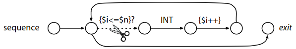

:source-highlighter: highlightjs
:revealjs_hash: true
:icons: font
:customcss: https://codepen.io/anstreth/pen/WNvVedL.css
:revealjs_theme: white
:stem: latexmath

= ANTLR 4 Parser generator 

[ANTLR v4: course code]

https://wuciawe.github.io/java/2017/04/12/notes-on-antlr4.html[Good ANTLR book notes]

https://dl.icdst.org/pdfs/files3/a91ace57a8c4c8cdd9f1663e1051bf93.pdf[The Definitive ANTLR 4 Reference (Book)]

https://www.researchgate.net/publication/273188534_Adaptive_LL_Parsing_The_Power_of_Dynamic_Analysis?enrichId=rgreq-4c62e82b87aa8e4f9457ae5950369e20-XXX&enrichSource=Y292ZXJQYWdlOzI3MzE4ODUzNDtBUzo0Njc1MjUyMDYwNTY5NjBAMTQ4ODQ3ODEwMzQ1Mg==&el=1_x_3&_esc=publicationCoverPdf[Adaptive LL(*) Parsing: The Power of Dynamic Analysis]

https://www.antlr.org/papers/LL-star-PLDI11.pdf[LL(*): The Foundation of the ANTLR Parser Generator]

== Grammars
Аny context-free grammar that does not contain indirect or hidden left-recursion:

```g4
expr : expo // indirectly invokes expr left recursively via expo
    | ...
    ;
expo : expr '^'<assoc=right> expr ;
```
Direct recursion supported through grammar rewriting prior to parser generation.

 Indirect or hidden recursion not supported "because these forms are much less common and removing all left recursion can lead to exponentially-big transformed grammars".

== *Mutators*
Side-effecting actions, written in the host language of the parser, in the grammar. The actions have access to the current state of the parser. The parser ignores mutators during speculation *(???)* to prevent actions from “launching missiles” speculatively.

== *Semantic predicates*
Side-effect free Boolean-valued expressions written in the host language that determine the semantic viability of a particular production. Semantic predicates that evaluate to false during the parse render the surrounding production nonviable, dynamically altering the language generated by the grammar at parse-time.

For example, a C grammar could have embedded actions to define type symbols from constructs, like `typedef int i32;`, and predicates to distinguish type names from other identifiers in subsequent definitions like `i32 x;`.

```g4
group: INT sequence[$INT.int] ;
sequence[int n]
locals [int i = 1;]
    : ( {$i<=$n}? INT {$i++;} )* // match n integers
    ;
```
False predicates make the associated alternative “disappear” from the grammar and, hence, from the generated parser. In this case, a false predicate makes the (...)* loop terminate and return from rule sequence.




== ALL(*) Parser (Adaptive LL)

incrementally builds DFA considering just the lookahead sequences it has been instead of all *possible* sequences.

=== Lexer
Generated automatically from grammar. Use variation of ALL(\*) that fully
matches tokens instead of just predicting productions like ALL(\*) parsers do. After *warm-up(???)* the lexer will have built a DFA.

=== Two-stage parsing
*Stage one*: try handle parsing with `SLL` (Strong LL) -- predication algorithm that don't use a stack state. `SLL` is weaker but faster than `LL`.

Grammar that exhibits a stack-sensitive decision in nonterminal A:

```
S → xB | yC 
B → Aa 
C → Aba 
A → b | eps
```
For string lookahead `ba` predicts `A → b` when `B` invokes `A` but predicts `A → eps` when `C` invokes `A`. `SLL` can't parse this case.

*Stage two*:  If `SLL` finds a syntax error, it might have found an `SLL` weakness or a real syntax error, so we have to retry the entire input using optimized `LL`. 
 
 "Nonetheless, the second (LL) stage must remain to ensure correctness."

=== Resolving ambiguity
Use semantic predicates and production order (choose first alternative).


== ATN vs RSM
 
 #todo -- they look like one thing

== Error recovery 
To recover, parsers consume tokens until a token appears that could follow the current rule.

For mismatched tokens, ANTLR attempts *single token insertion* and *single token deletion* upon mismatched token errors if possible

ANTLR provides hooks to override reporting and recovery strategies (user can implement they own one).

Each ANTLR-generated rule method is wrapped in a try-catch that responds
to syntax errors by reporting the error and attempting to recover before
returning.

```java
try {
    ...
}
    catch (RecognitionException re) {
    _errHandler.reportError(this, re);
    _errHandler.recover(this, re);
}
```

recover() try consume tokens until find one from the following set resynchronization set for rule is a following set that enable in this context. For example, if FOLLOW = {')', ']'} and in context '(' then resynchronization set contains only ')'.

#TODO check how override error handling

#TODO see labels for stop recovery process

== Embedding Actions Within Rules 

=== Members 
New members will be added as a parser fields/methods 

```g4 
@parser::members { // add members to generated RowsParser
    int col;

    public RowsParser(TokenStream input, int col) { // custom constructor
        this(input);
        this.col = col;
    }
}
```

=== Locals 
The action within rule row accesses $i, the local variable defined with the locals clause. The declarations in a locals section
become fields in the rule context object.

```g4
file locals [int i=0]: hdr row+;
```

==== Pass parameter to rules 
Use square braced instead of parentheses (they are used for subrule syntax).

```g4
row
locals [int i=0]
    : ( STUFF
        {
            $i++;
            if ( $i == col ) System.out.println($STUFF.text);
        }
    )
    ;
```

In parser method `row` will be generate code above

```Java
((RowContext)_localctx).STUFF = match(STUFF);

_localctx.i++;
if ( _localctx.i == col ) System.out.println((((RowContext)_localctx).STUFF!=null?((RowContext)_localctx).STUFF.getText():null));
			          
```

== Matching
In lexer rules 

```g4
STUFF: ~[\t\r\n]+ ; // match any chars except tab, newline
ID : [a-z]+ ; // match lower-case identifiers
ID2: ('a'..'z')+; //same
WS : [ \t\r\n]+ -> skip ; // match but don't pass to the parser
```

=== Keywords 
```g4
enumDef : 'enum' '{' ... '}' ;
...
FOR : 'for' ;
...
ID : [a-zA-Z]+ ; // does NOT match 'enum' or 'for'
```
=== Fragment 
By prefixing the rule with fragment, we let ANTLR know that the
rule will be used only by other lexical rules. It is not a token in and of itself. This means that we could not reference DIGIT from a parser rule.

```g4
FLOAT: DIGIT+ '.' DIGIT* // match 1. 39. 3.14159 etc...
    | '.' DIGIT+ // match .1 .14159
    ;
fragment
DIGIT : [0-9] ; // match single digit
```

=== Subrules 
Nongreedy parser subrules match the shortest sequence of tokens that preserves a successful parse for a valid input sentence
== Debug 
`ANTLR` provides a flexible testing tool in the runtime library called `TestRig` (`java org.antlr.v4.runtime.misc.TestRig`). It can display lots of information about how a recognizer matches input from a
file or standard input. `TestRig` uses Java reflection to invoke compiled recognizers. TestRig has option `SLL` for faster but slightly weaker parsing strategy. Uses in a IDEA GUI debug tool.

== Project Extensions 
`Visitor` and `Listener` generated for grammar has a default implementation for each node so i'ts easy to override only needed part.

Base node class can be replaced with an arbitrary class inherited from the ANTLR node.

ANTLR provides hooks to override reporting and recovery strategies (user can implement they own one).

== Lexical modes 
Island Grammars: dealing with different formats in the same file. For example, JavaDoc mini language in Java files.

ANTLR provides a lexer feature called *lexical modes*. The lexer switch back and forth between modes when it sees special sentinel character sequences. In example chars `<` and `>` -- a triggers for changing lexer mode.

```g4 
lexer grammar XMLLexer;

// Default "mode": Everything OUTSIDE of a tag
OPEN        :   '<'                 -> pushMode(INSIDE) ;
COMMENT     :   '<!--' .*? '-->'    -> skip ;

// ----------------- Everything INSIDE of a tag ---------------------
mode INSIDE;

CLOSE       :   '>'                 -> popMode ; // back to default mode
SLASH_CLOSE :   '/>'                -> popMode ;
//...

```

== Rewriting the Input Stream
Implement listener that will be accept a Parser instance and rewrite code. In example rewriter add filed with `long` in `class` definition.

```java
public class InsertSerialIDListener extends JavaBaseListener {
    TokenStreamRewriter rewriter;
    public InsertSerialIDListener(TokenStream tokens) {
        rewriter = new TokenStreamRewriter(tokens);
    }

    @Override
    public void enterClassBody(JavaParser.ClassBodyContext ctx) {
        String field = "\n\tpublic static final long serialVersionUID = 1L;";
        rewriter.insertAfter(ctx.start, field);
    }
}
```

== Sending Tokens on Different Channels
```g4
COMMENT: '/*' .*? '*/' -> channel(HIDDEN) // match anything between /* and */;
WS : [ \r\t\u000C\n]+ -> channel(HIDDEN);
```
The `-> channel(HIDDEN)` is a lexer command. This tokens will bw ignored by parser.

[cols="1,1"]
|===
|Pattern Name 
|ANTLR 

|Sequence
|x y ... z 

'[' INT+ ']'

|Sequence with terminator
|(statement ';')*

|Sequence with separator
|stat ('.' stat)*


|Choice
|tag : '<' Name attribute* '>' \| '<' '/' Name '>'

|Token dependency
|'(' expr ')'

|Nested phrase (recursive)
|expr : '(' expr ')' \| ID ;

|Associative
|expr : expr '^'<assoc=right> expr 

|Operator precedence (priority)
| link:https://www.engr.mun.ca/~theo/Misc/exp_parsing.htm[Precedence Climbing]

|=== 