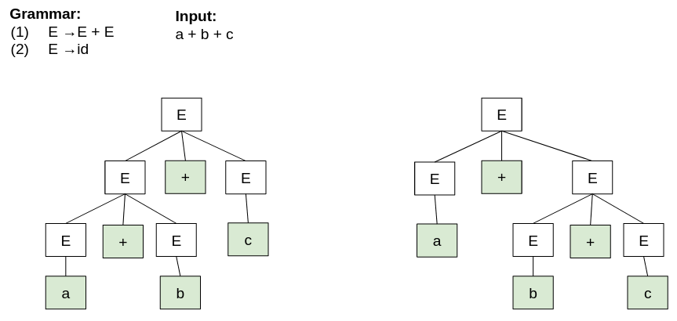
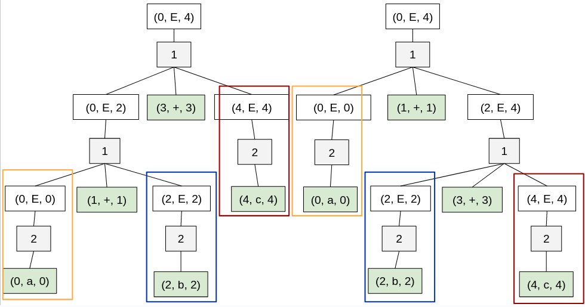
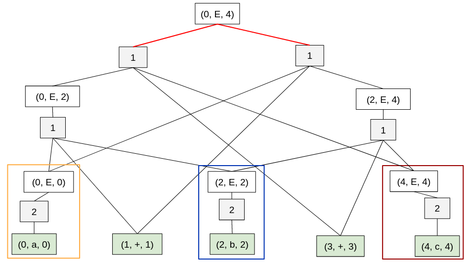
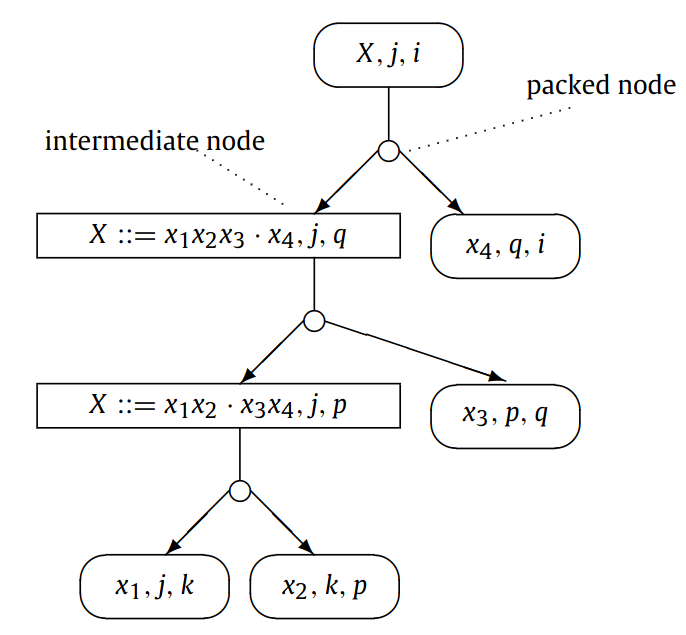
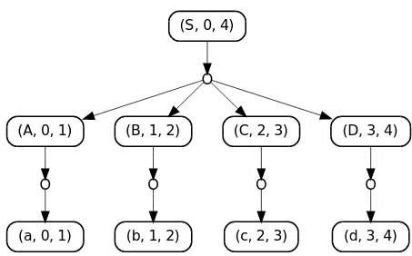
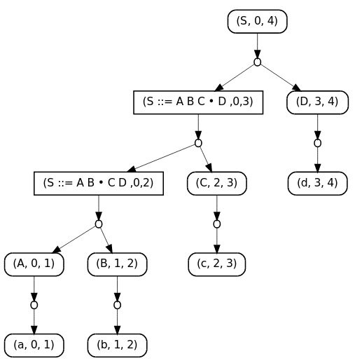

:stem: asciimath
:toc:

= Derivations trees
Is designed to reduce the space required to represent multiple derivation tree

== 1. SPPF: Shared packed parse forests
* In the worst case an SPPF can be of unbounded polynomial size
* In binarised form -- worst case cubic size

Contains two types of nodes:

* *symbol* nodes (x, j, i), where stem:[x \in \{T, N,\epsilon}],  0 ≤ j ≤ i ≤ m. Corresponds to the parsing of substring [i, j] by symbol x.
* *??* nodes (i), correspond number of rule

Ambiguous result of the parsing: set of AST

SPPF 

In an SPPF, nodes which have the same tree below them are shared and nodes which correspond to different derivations of the same substring from the same nonterminal are combined by creating a packed node for each family of children. 

== 2. Binarised SPPF: Shared packed parse forests
Contains three types of nodes:

* *symbol* nodes (x, j, i), where stem:[x \in \{T, N,\epsilon}],  0 ≤ j ≤ i ≤ m. Corresponds to the parsing of substring [i, j] by symbol x.
** For stem:[x \in T] has no children.
** For stem:[x \in N] has packed node children of the form (A ::= γ ·, k)
* *intermediate* nodes (t, j, i); 
** have packed node children with labels of the form (t, k), where j ≤ k ≤ i.
* *packed* nodes (t, k), where 0 ≤ k ≤ m and t is a grammar slot, t = X ::= α · β.
** have one or two children: the right child is a symbol node, and the left child (if it exists) is a symbol or intermediate node

*Example*

Grammar: 

stem:[
S \to ABCD, \ A \to a, \ B \to b, \ C \to c, \ D \to d 
]

*Simple SPPF*

*Binarised SPPF*

 #todo описать sppf, который реализован у нас в парсере

== 3. BSR: binary subtree representations
Original article: https://www.sciencedirect.com/science/article/pii/S0167642318302302[Derivation representation using binary subtree sets]

 Note: интересная структура данных со своими преимуществами. Но необходимо модифицировать алгоритм парсинга. Можно в будущем использовать как оптимизацию по памяти/сложности конструируемого парсера.

* No need for graph construction machinery -> Parsers that generate BSR sets are simpler to construct and require less runtime space
* No edges are computed or stored
