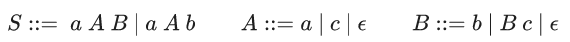
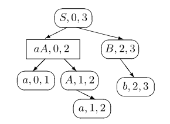

:stem: asciimath
:toc:

= Derivations trees

https://bachisheo.github.io/Parsers-Overview[Start page]

Is designed to reduce the space required to represent multiple derivation tree

== 1. SPPF: Shared packed parse forests
* In the worst case an SPPF can be of unbounded polynomial size
* In binarized form -- worst case cubic size

Contains two types of nodes:

* *symbol* nodes (x, j, i), where stem:[x \in \{T, N,\epsilon}],  0 ≤ j ≤ i ≤ m. Corresponds to the parsing of substring [i, j] by symbol x.
* *??* nodes (i), correspond number of rule

Ambiguous result of the parsing:

*set of AST*

*SPPF* 

image::media/2024-01-11-17-50-30.png[]

In an SPPF, nodes which have the same tree below them are shared and nodes which correspond to different derivations of the same substring from the same nonterminal are combined by creating a packed node for each family of children. 

== 2. Binarized SPPF
A binarized SPPF is obtained from a set of indexed BDTs by merging (sharing) nodes with the same label and putting separate families of children under packed nodes <<sjb19>>. 

Contains three types of nodes:

* *symbol* nodes (x, j, i), where stem:[x \in \{T, N,\epsilon}],  0 ≤ j ≤ i ≤ m. Corresponds to the parsing of substring [i, j] by symbol x.
** For stem:[x \in T] has no children.
** For stem:[x \in N] has packed node children of the form (A ::= γ ·, k)
* *intermediate* nodes (t, j, i), where t -- slot between children, right children -- last symbol of productions in slot, left -- first symbol or slot with one step to left.
** have packed node children with labels of the form (t, k), where j ≤ k ≤ i.
* *packed* nodes (t, k), where 0 ≤ k ≤ m and t is a grammar slot, t = X ::= α · β.
** have one or two children: the right child is a symbol node, and the left child (if it exists) is a symbol or intermediate node

image::media/2024-01-11-17-14-56.png[]

*Example*

Grammar: 

stem:[
S \to ABCD, \ A \to a, \ B \to b, \ C \to c, \ D \to d 
]

*Simple SPPF*

image::media/2024-01-11-18-25-29.png[]

*Binarized SPPF*

== 3. BSR set: binary subtree representations set <<sjb19>>

If a packed node, w, has children (β, i, k) and (x, k, j) then w has label (βx, k) or (X ::= βx, k), so we can compute the
children, and the parent, of w if the label of w is modified to be (βx, i, k, j) or (X ::= βx, i, k, j). 

So we can merge 3 node into one BSR element.

The #BSR element# in stem:[\Gamma] is a 4-tuple stem:[(\Omega, i, k, j)], where 0 ≤ i ≤ k ≤ j and stem:[\Omega] in one of the form:

* stem:[X, X := α] is a production in stem:[\Gamma], 
* stem:[\beta, |\beta| > 1] and for some X and δ, stem:[X := βδ] is a production in stem:[\Gamma].

=== Example 
*Grammar* 

*Input*: "aab"

*Binarised SPPF*

*BSR set*

stem:[\{(S := a AB, 0, 2, 3), (S := a Ab, 0, 2, 3), (a A, 0, 1, 2), (B := b, 2, 2, 3), (A := a, 1, 1, 2)}]

We can restore binarized SPPF from BSR set.

* No need for graph construction machinery -> Parsers that generate BSR sets are simpler to construct and require less runtime space
* No edges are computed or stored

 Note: интересная структура данных со своими преимуществами. Но необходимо модифицировать алгоритм парсинга. Можно в будущем использовать как оптимизацию по памяти/сложности конструируемого парсера.

[bibliography]
== References

* [[[sjb19]]] Elizabeth Scott, Adrian Johnstone, L. Thomas van Binsbergen,
Derivation representation using binary subtree sets,
Science of Computer Programming, Volume 175,
2019, Pages 63-84