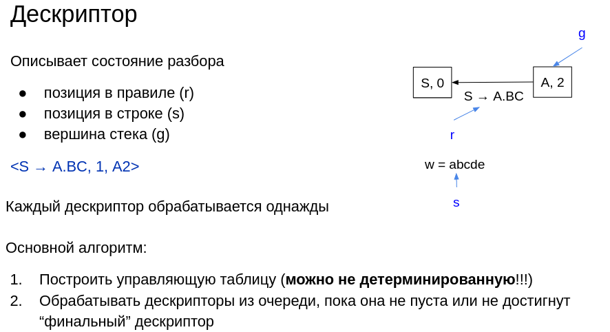
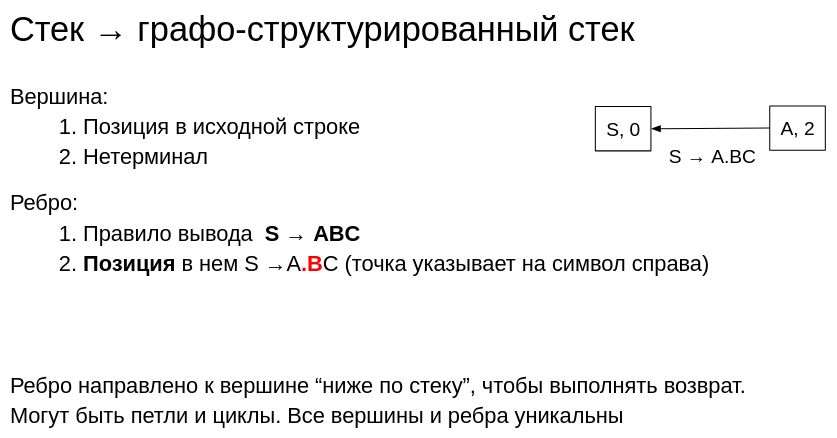

:stem: asciimath
:toc:

= Gll 

== Original GLL

`+` any CF grammar

`+` Is stem:[O(n^3)] in worst case 

 #todo -- унифицировать описание, приложить ссылки

=== Helper data structures
Use one of https://bachisheo.github.io/Parsers-Overview/trees/[derivations trees] to store a set of ASTs.

==== Descriptor 



==== GSS: graph structured stack 
Shares common initial substacks and recombines stacks when their associated processes converge



=== Algorithm

* Build a control table (can be non-deterministic!!!)
* Process descriptors from the queue until it is empty or the "final" descriptor is reached

Descriptor processing: 

* *Terminal*
<A → a #.t# Bm, i, stackA> 

** move the pointer in the string
** add a new descriptor

```
if(w[i] != t) {
    terminate  
}

descriptors.put(<A → at (.B) m, (i + 1), stackA>)
```
* *Nonterminal*
<A → at #.B# Cm, i, stackA> 

** Add descriptors for all valid rules `B → X`
```kotlin
stackB = findOrCreate(stack(B, i))
e = getOrCreateEdge(stackB, stackA, A → atB(.C))

forall (B → X) : table[B,w[i]]{
	descriptor.put(<B → (.X)K, i, stackB>)
} 
```
* *End* of rule: <A → B #.#, i, stack>

** Go back up "across all stacks"

```
for (stack, back_stack, rule): edges{
	deskriptor.put(<rule, i, back_stack>)
}
```


== CNP: clustered nonterminal parsing

Modification of LL(1) to recognize all KC grammars. Similar to GLL, but uses BSR. It is faster, more efficient in memory and time.

But due to the absence of SPPF edges, the error recovery algorithm cannot be applied.

== RGLL: reduced descriptor GLL parsers

The RGLL algorithm <<sj16>> is a parser which uses the traditional GSS but uses the notion of ‘pop equivalence’ to group together GSS
nodes, allowing less information to be stored in the descriptors.


[bibliography]
== References

* [[[sjb19]]] Elizabeth Scott, Adrian Johnstone, L. Thomas van Binsbergen,
Derivation representation using binary subtree sets,
Science of Computer Programming, Volume 175,
2019, Pages 63-84
* [[[sj16]]] Elizabeth Scott, Adrian Johnstone,
Structuring the GLL parsing algorithm for performance,
Science of Computer Programming,
Volume 125,
2016,
Pages 1-22,
ISSN 0167-6423,
https://doi.org/10.1016/j.scico.2016.04.003.
(https://www.sciencedirect.com/science/article/pii/S016764231630003X)
