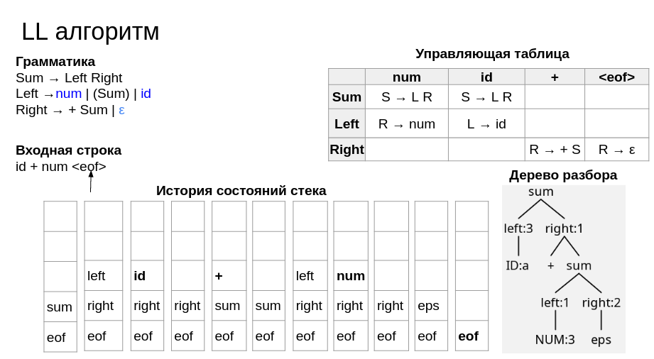

:lang: ru-RU
:source-highlighter: rouge
:stem: asciimath
:toc:
= Recognizer techniques

https://bachisheo.github.io/Parsers-Overview[Start page]

A recognizer for a language stem:[L(\Gamma)], specified by a grammar, Γ, is an algorithm that takes as input a string w, and returns success if stem:[w \in L(\Gamma)] and failure otherwise.

== Continuation passing combinator parsers (Johnson)

 #todo
 
Mark Johnson: The computational complexity of GLR parsing
Generalized LR Parsing, Kluwer Academic Publishers, The Netherlands (1991), pp. 35-42 

== Earley recognisers
* is worst-case order cubic on general context free grammars and worst-case quadratic order on non-ambiguous grammars

 #todo   

Jay Earley: An efficient context-free parsing algorithm
Commun. ACM, 13 (2) (February 1970), pp. 94-102

== LL(k)

`+` Простой эффективный алгоритм парсинга

`+` O(|w|)

`-` Поддерживает только LL(k) грамматики (подмножество КС)

`-` Левая рекурсия неразрешима

Не LL(1) грамматика:

A → *a* X C | *a* Y C

Невозможно определить, по какому правилу продолжать разбор после *а*

==  CYK algorithm
  * Is worst-case cubic order on grammars in Chomsky normal form

  H Younger, Recognition of context-free languages in time n3 , Information and Control 10 (2) (1967) 189–208.