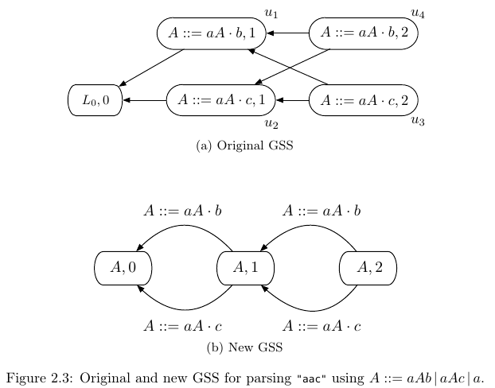
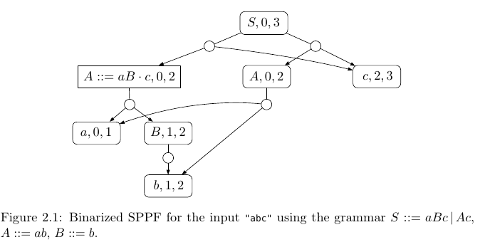

= GLL improvements (33-55)

Chapter 2 presents a number of improvements to GLL parsing.

* a new GSS structure
* optimizations to GLL parsing
* implementation of lookup tables in an object-oriented implementation of GLL
* lexical disambiguation filters 

== A new GSS structure 

== Binarized SPPF

Three types of nodes:

*  *Symbol* nodes of the form (x, i, j) x is a terminal (leaf) or nonterminal, and i and j are the left and right extents 

* *Intermediate*  nodes of the form (A ::= α · β, i, j), where |α|, |β| > 0, and i and j are the left and right extents

* *Packed* (rounded) nodes stay after symbol-nonterminal or intermediate nodes. Has at most two children, both non-packed nodes. A packed node represents a derivation. Has at least two not-packed children.

== Lexical disambiguation Filters for Scannerless GLL Parsing

Constructs are added to the grammar that affect the handling of descriptors during parsing. 

For a grammar rule `A ::= αxβ`

* *Follow restriction* for the _symbol_ x is written as `A ::= αx !>> cβ`, meaning that derivations of the form `γAσ⇒γαxβσ⇒* γαxcτ`  are disallowed. Specifies which characters cannot immediately appear after a symbol in a rule.

 Used to locally define longest match, for example  Id ::= [A-Za-z]+ !>> [A-Za-z]

* *Precede Restriction* for the _symbol_ x is written as `A ::= αc !<< xβ`, meaning that derivations of the form `γAσ⇒γαxβσ⇒* τcxβσ` are disallowed. Specifies the characters that cannot immediately precede a symbol in a rule.

 Can be used to implement longest match on keywords. For example, [A-Za-z] !<< Id 

* *Exclusion of string* s from the _nonterminal_ X is written as `A ::= αX\sβ`, meaning that the language L accepted by the nonterminal X should not contain the string s, i.e., `L(X\s) = L(X) − {s}`.  Used to implement keyword reservation. 

    For example, Id \'int' excludes the keyword int from being recognized as Id.
