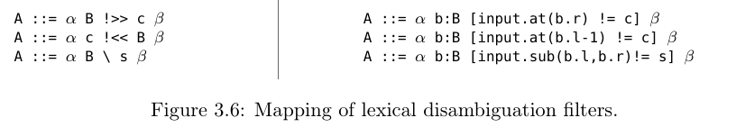
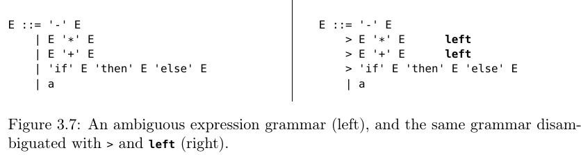

= Data-dependent GLL Parsing (55-95)

Presents a parsing framework based on *data-dependent grammars* and an implementation based on GLL parsing.

== Data-dependent grammars (3.3.1)
Intermediate parser-independent layer for implementing various disambiguation constructs. They are rather low-level, so we give examples of high-level disambiguation constructs and mappings them to data-dependent grammars.

*Context-free* grammar: 

`L8 ::= '∼{' Number '}' Octets`

*Data-dependent* grammar

`L8 ::= '∼{' nm:Number {n=toInt(nm.yield)} '}' Octets(n)`

`Octets(n) ::= [n > 0] Octets(n - 1) Octet
    | [n == 0] ε`

Conditions `[n > 0]` and `[n == 0]` specify which alternative is selected at each iteration.

Data-dependent grammars are extension of *context-free grammars* (CFGs), where a CFG is, as usual, a tuple (N, T, P, S).

*Data-dependent grammars* introduce parametrized nonterminals, arbitrary computation via an expression language `e` ( a simple functional programming language with immutable values and no side-effects), constraints, and variable binding. 

For each rule `A(p) ::= α`, `p` is a formal parameter of A

The body of a rule, α, can contain the additional symbols:

*  `x = l : A(e)` is a labeled call to A with argument e, label l, and variable x bound to the value returned by `A(e)`;
*  `l : a` is a labeled terminal a with label l;
* `[e]` is a constraint;
* `{x = e}` is a variable binding;
* `{e}` is a return expression (only as the last symbol in α);
* `e ? α : β` is a conditional selection.

Additions:

1. Each terminal and nonterminal has properties 'l' and 'r' corresponds to left end right extends of parsing substrings.
2. Nonterminals can return arbitrary values (return expressions)  which can
be bound to variables.
3. Regular expression operators (EBNF constructs): `∗`, `+`, and `?`; also `!` for negative: `NotSlashOrAsterisk ::= ![/ *]` 
4. conditional selection symbol e ? α : β introduce deterministic choice. `A ::= α e ? X : Y β` is translated to `A ::= α C(e) β`,
where `C(b) ::= [b] X | [!b] Y`.

==  Mapping lexical disambiguation filters to data-dependent grammar

== Follow/precede restrictions and keyword reservation (3.3.3)

Also used for represent:

* Operator Precedence and Associativity (3.3.4)

* Indentation-sensitive Constructs (3.3.5)

* Conditional Directives (3.3.6)

* Miscellaneous Features (3.3.7)