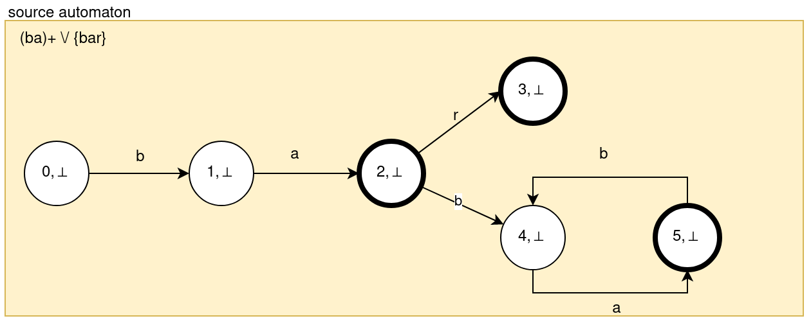
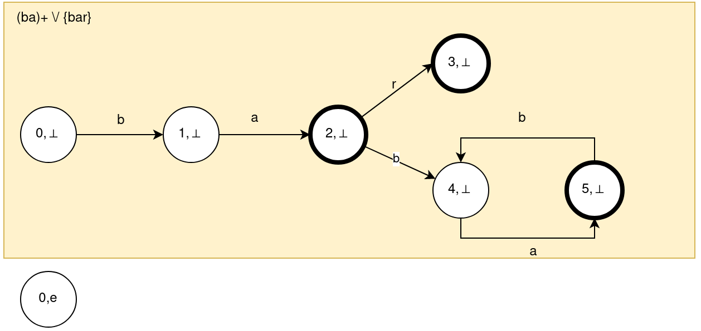
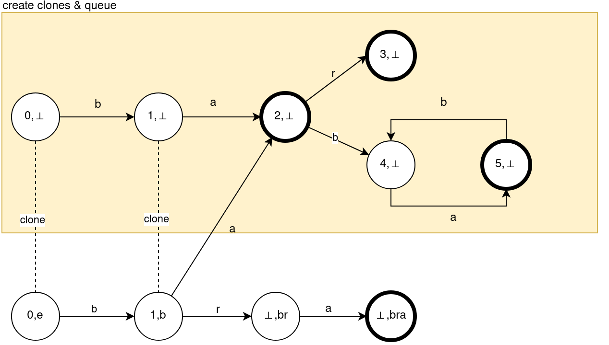
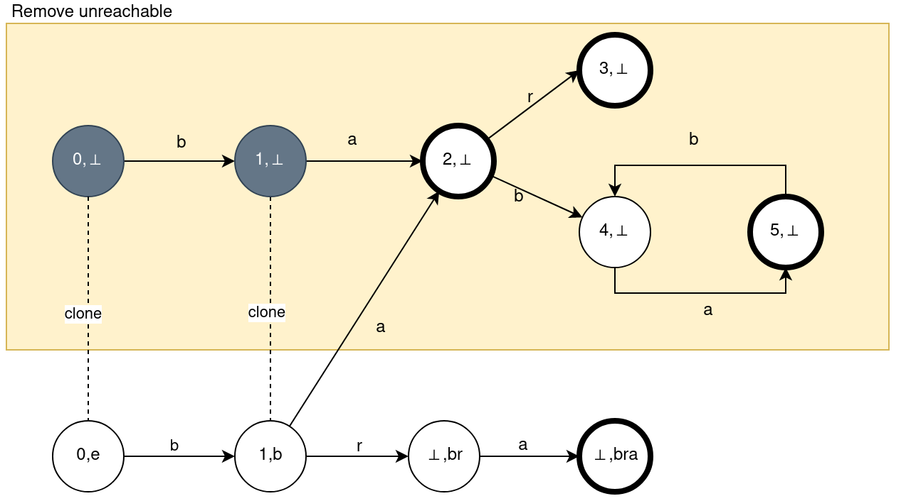
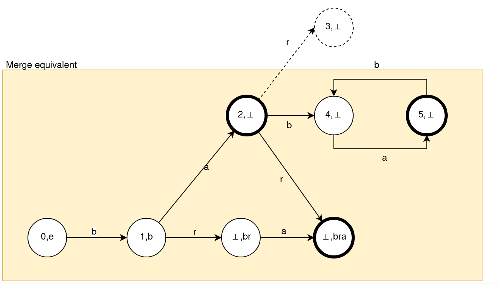
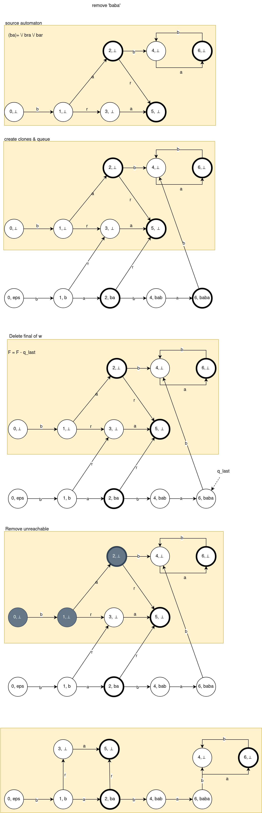

:source-highlighter: highlightjs
:revealjs_hash: true
:icons: font
:customcss: https://codepen.io/anstreth/pen/WNvVedL.css
:revealjs_theme: white
:stem: latexmath

= Incremental Construction and Maintenance of Minimal Finite-State Automata 

These file contains a brief synopsis of the https://aclanthology.org/J02-2004/[article (2002)]

Describe a simple and equally efficient method for modifying any *(possibly cyclic) minimal complete finite-state* automaton so that a string is added to or removed from the language it accepts

== Mathematical Preliminaries
=== Intersection
*Intersection* (complete) automaton has 

* stem:[Q = Q_1 \times Q_2]
* stem:[q_0 = (q_{01}, q_{02})]
* stem:[F = F_1 \times F_2]
* stem:[\delta((q_1, q_2), a) = (\delta(q_1, a), \delta(q_2, a))]

=== *Complementary* automaton
* F' = Q - F

=== Union automaton
The resulting automaton M is identical to the intersection automaton defined above except that

* stem:[F = F_1 \times Q_2 \cup F_2 \times Q_1]

=== Adding a String w
Has to be minimized! 

Result automaton has four kinds of states stem:[Q = (Q_1, Q_2)]:
 
==== 1. Intact states
stem:[(q, \bot_w), q \neq \bot] 

* equivalent to q (same right part)
* final if q is final
* may be eliminated
* can't be merge by minimization
* number of intact ranges ranges between |Q| − |w| − 1 and |Q|

==== 2. Cloned states 
stem:[(q, x)]

* modified versions of the original states 
* final if q finel or x = w 
* stem:[\delta'((q, x), a) = if~xa \in Pr(w)~ \delta((q, a), xa) ~else ~\delta((q, a), \bot_w)]
* at most |w| + 1

Include new start state stem:[q_0'=(q_0, \epsilon)]

==== 3. Queue states 
stem:[(\bot, x)]

* created if x not contained in Q
* at most |w| + 1 states 
* final if final in w

==== 4. Absorption (Empty) state 
stem:[\bot' = (\bot, \bot_w)]

=== Removing 
automaton M' accepting stem:[L(M') = L(M) - w = L(M) \cap (\sum^* - {w})]

=== Minimization 
List R -- register contains all of the intact states. Compare cloned and queue states to them, and add in R if they not found equivalent.

== Algorithm: add string 
* Intact states stem:[(q, \bot_w), q \neq \bot] 
* Cloned states stem:[(q, x)]
* Queue states stem:[(\bot, x)]
* Absorption (Empty) state stem:[\bot' = (\bot, \bot_w)]

Example: add `bra` to stem:[(ab)^+ \cup {bar}]

* 1. Initialize register array with stem:[(q, \bot_w) \forall q \in Q]



* 2. stem:[q'_0 = (q_0, \epsilon)]



* 3. For all prefix of w incrementally add a states. Clone if can with all outputs.



* 4. Remove unreachable from stem:[q'_0 = (q_0, \epsilon)] from Q and R. Replace stem:[q_0 = q_0']



* 5. Replace duplicates states in added and R: merge with register for all suffix from last. States are duplicates if all their productions are equivalent and they bot final are not.



Production of equiv states leads to the same state (not equiv!) because it's state from R and in R cant be few equiv states.

```Kotlin 
fun replace_or_register(q){
    if R contains p: p equiv q {
        merge(p, q)
    }
    else {
        R.add(q)
    }
}


fun equiv(p, q){
    if (p.isFinal != q.isFinal) return false
    (for a in Alphabet){
        if(prod(p, a) == prod(q, a))
            return false
    }
    return true
}
```

== Algorithm: remove string 
Same as adding but adding statement stem:[F = F - {q_{last}}]




Было бы прикольно узнавать что-то про пути (это больше к Ивану)