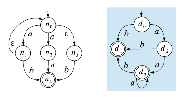
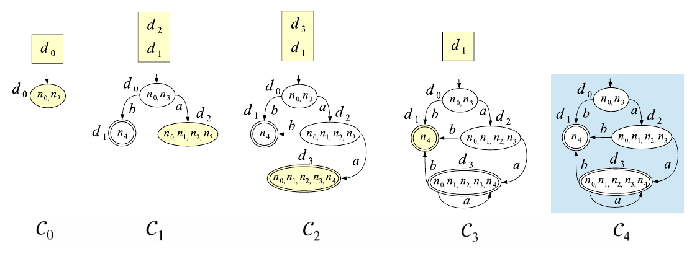
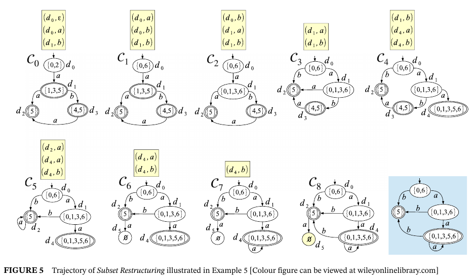

:source-highlighter: highlightjs
:revealjs_hash: true
:icons: font
:customcss: https://codepen.io/anstreth/pen/WNvVedL.css
:revealjs_theme: white
:stem: latexmath

= Temporal determinization of mutating finite automata. Reconstructing or restructuring
The file contains a brief synopsis of the article

Motivation for determinization:

 "Typically, checking the membership of a string in a regular language is generally more efficient when the process of recognition is performed on a DFA rather than on an NFA, because no backtracking is required"

== FA and determinization 
The language recognized by an FA is called a regular language. The set of regular languages equals the set of languages that can be defined by the Type-3 grammars in the classification of Chomsky.

Deterministic FA is a 5-tuple  stem:[DFA = (\sum, D, T_d, d_0, F_d)], where

* Σ is the alphabet (a finite set of symbols),
* D is the set of states, 
* stem:[T_d] is the transition function, stem:[T_d: D \times \sum^* \to D],
* d0 is the initial state, 
* and stem:[F_d] ⊆ D is the set of final states. 

Determinism comes from stem:[T_d] mapping a state-symbol pair into a single state. 

== Subset Construction determinization algorithm 
A Subset Construction determinization algorithm it's a classical algorithm. It is a function mapping an NFA into an SC-equivalent DFA.
Operationally, the DFA is constructed from scratch starting from the initial state and generating the transition function of each node created. We call this process static determinization, because the NFA does not change with time.

For each state d in DFA corresponds subset of states in NFA (n), which called d extension and sing stem:[||d|| \subset N].

Processing a state d in the stack means generating the transition function of d, that is, the set of transitions ⟨d,l,d'⟩ exiting d and entering another state d'. 

stem:[d_0 = closure(\epsilon, n_0, NFA)]

image::2023-11-16T14-48-13-256Z.png[] 

determinization:

subset construction:

== Subset Restriction determinization algorithm 

stack B contains bud -- pair of D state d and symbol l.

the set of states in D is partitioned into a finite set of strata, namely, D0, D1, ... , Dk , with each stratum Di , i ∈ [0 ... k], including the set of states d such that δ(d) = i.

Buds in B partially ordered based on δ(d).

... 

